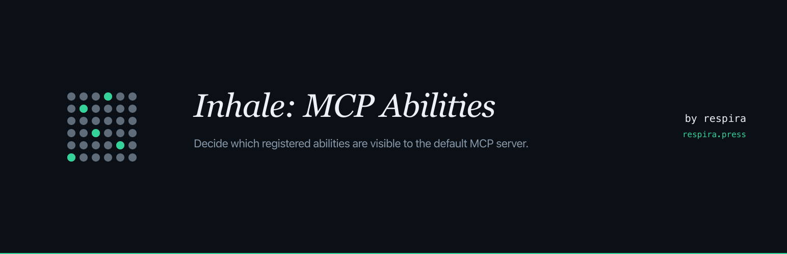

<p align="center">
  
</p>

# Inhale: MCP Abilities

A WordPress plugin that gives administrators a settings page for choosing which registered abilities are visible to the default MCP server.

The default MCP Adapter ships with abilities hidden by default; admins have been writing PHP filters as a workaround. Inhale: MCP Abilities replaces that workaround with a UI.

- **Website:** https://respira.press/inhale
- **License:** GPL-2.0-or-later
- **Requires:** WordPress 6.8+, PHP 7.4+, the [official WordPress MCP Adapter](https://github.com/WordPress/mcp-adapter) plugin

## What it does

- Lists every ability registered via the WordPress Abilities API (`wp_get_abilities()`) across all active plugins and themes.
- Lets administrators choose which abilities are exposed to the default MCP server with standard wp-admin bulk actions (select + Inhale/Exhale + Apply) or row-hover quick actions.
- Surfaces annotation metadata (`read-only`, `destructive`, `idempotent`) on each ability so administrators can make informed decisions, with heuristic inference for abilities whose registering plugin did not declare annotations.
- Requires confirmation when exposing destructive abilities.
- Provides MCP-client connection info (Claude Desktop, Cursor, Claude Code) directly on the settings page.

## What it does not do

- Does not run any MCP servers, transports or authentication. Those are handled by the official MCP Adapter plugin, which Inhale: MCP Abilities extends.
- Does not register any abilities of its own. It only toggles visibility of abilities other plugins have registered.
- Does not phone home, collect telemetry or make external network requests.

## How it works

The plugin hooks `wp_register_ability_args` at priority 10. When an ability's name appears in the saved option (`inhale_mcp_abilities_public_abilities`), the filter sets `meta.mcp.public = true` on it at registration time, which is the documented mechanism the default MCP Adapter consumes to expose abilities.

This matches the workaround pattern documented in WordPress contributor guides, so existing developer code (`add_filter( 'wp_register_ability_args', ... )` in `functions.php` or an mu-plugin) continues to work alongside the plugin without conflict.

## Install

From the WordPress.org plugin directory: search for "Inhale: MCP Abilities" inside `Plugins → Add New`, install, activate.

From GitHub (manual): download the latest release zip, upload via `Plugins → Add New → Upload Plugin`, activate.

Once active, the page lives at **Settings → Inhale: MCP Abilities**.

## About Respira

The Inhale: MCP Abilities plugin is built by Respira, which ships AI infrastructure for WordPress. The main product is [Respira for WordPress](https://respira.press), a safety layer that registers 130+ abilities across 12 page builders (Elementor, Bricks, Divi, Beaver Builder, Oxygen, Breakdance and 6 more) with snapshot-before-write protection, render validation and one-click rollback.

Inhale: MCP Abilities is a free utility offered to the WordPress community. The two products are separate; Inhale: MCP Abilities works on its own and is not affiliated with Respira for WordPress beyond authorship.

## MCP and Anthropic

Model Context Protocol (MCP) is an open specification originally developed by Anthropic. Inhale: MCP Abilities is a third-party plugin and is not affiliated with, endorsed by or sponsored by Anthropic. Respira is an independent company.

## Contributing

Issues and pull requests welcome on this repository. For substantial changes, please open an issue first to discuss the approach.

## Development

```
git clone https://github.com/respira-press/inhale-mcp-abilities.git
cd inhale-mcp-abilities
# Symlink into your wp-content/plugins/ for local dev, e.g.:
ln -s "$PWD" /path/to/your/site/wp-content/plugins/inhale-mcp-abilities
```

Run `php -l` on the includes for a syntax check. PHPUnit harness lives in `tests/` and self-skips when `WP_TESTS_DIR` is not set; install the WP test suite via `bin/install-wp-tests.sh` to run them.
